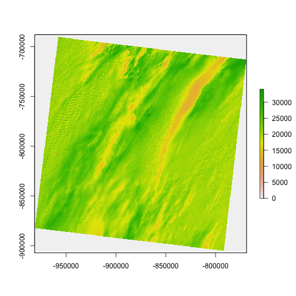

getlandsat
==========


[](https://travis-ci.org/ropenscilabs/getlandsat)
[](https://codecov.io/gh/ropenscilabs/getlandsat)
[](https://github.com/metacran/cranlogs.app)

`getlandsat`: Get Landsat 8 data from AWS public data sets

`getlandsat` provides access to Landsat <https://landsat.usgs.gov> 8 metadata and images hosted on AWS S3 at <https://aws.amazon.com/public-data-sets/landsat>. The package only fetches data. It does not attempt to aid users in downstream usage, but some additional functionality may be added.

Potential users are probably anyone from scientists asking questions about biodiversity or land use change, to software developers creating tools for users to vizualize their data.

## Install

Stable version


```r
install.packages("getlandsat")
```

Dev version


```r
devtools::install_github("ropenscilabs/getlandsat")
```


```r
library("getlandsat")
```

## List scenes


```r
(res <- lsat_scenes(n_max = 10))
#> # A tibble: 10 x 11
#>                 entityId     acquisitionDate cloudCover processingLevel
#>                    <chr>              <time>      <dbl>           <chr>
#> 1  LC80101172015002LGN00 2015-01-02 15:49:05      80.81            L1GT
#> 2  LC80260392015002LGN00 2015-01-02 16:56:51      90.84            L1GT
#> 3  LC82270742015002LGN00 2015-01-02 13:53:02      83.44            L1GT
#> 4  LC82270732015002LGN00 2015-01-02 13:52:38      52.29             L1T
#> 5  LC82270622015002LGN00 2015-01-02 13:48:14      38.85             L1T
#> 6  LC82111152015002LGN00 2015-01-02 12:30:31      22.93            L1GT
#> 7  LC81791202015002LGN00 2015-01-02 09:14:45       7.67            L1GT
#> 8  LC82111112015002LGN00 2015-01-02 12:28:55      43.43            L1GT
#> 9  LC81950292015002LGN00 2015-01-02 10:17:20      21.02             L1T
#> 10 LC81790452015002LGN00 2015-01-02 08:44:49       1.92             L1T
#> # ... with 7 more variables: path <int>, row <int>, min_lat <dbl>,
#> #   min_lon <dbl>, max_lat <dbl>, max_lon <dbl>, download_url <chr>
```

## List scene files


```r
lsat_scene_files(x = res$download_url[1])
#>                                 file    size
#> 1   LC80101172015002LGN00_B4.TIF.ovr   7.7MB
#> 2  LC80101172015002LGN00_B11.TIF.ovr  17.0KB
#> 3       LC80101172015002LGN00_B5.TIF  56.8MB
#> 4      LC80101172015002LGN00_BQA.TIF   2.7MB
#> 5      LC80101172015002LGN00_MTL.txt   7.5KB
#> 6   LC80101172015002LGN00_B5.TIF.ovr   7.8MB
#> 7   LC80101172015002LGN00_B2.TIF.ovr   7.5MB
#> 8   LC80101172015002LGN00_B1.TIF.ovr   7.5MB
#> 9   LC80101172015002LGN00_B7.TIF.ovr   7.9MB
#> 10      LC80101172015002LGN00_B4.TIF  55.4MB
#> 11      LC80101172015002LGN00_B8.TIF 212.3MB
#> 12  LC80101172015002LGN00_B3.TIF.ovr   7.6MB
#> 13      LC80101172015002LGN00_B3.TIF  54.4MB
#> 14      LC80101172015002LGN00_B2.TIF  54.0MB
#> 15 LC80101172015002LGN00_B10.TIF.ovr  17.0KB
#> 16  LC80101172015002LGN00_B6.TIF.ovr   7.9MB
#> 17  LC80101172015002LGN00_B9.TIF.ovr   7.0MB
#> 18     LC80101172015002LGN00_B11.TIF   0.1MB
#> 19  LC80101172015002LGN00_B8.TIF.ovr  29.0MB
#> 20      LC80101172015002LGN00_B1.TIF  54.2MB
#> 21     LC80101172015002LGN00_B10.TIF   0.1MB
#> 22      LC80101172015002LGN00_B6.TIF  58.0MB
#> 23 LC80101172015002LGN00_BQA.TIF.ovr   0.6MB
#> 24      LC80101172015002LGN00_B7.TIF  58.0MB
#> 25      LC80101172015002LGN00_B9.TIF  49.6MB
```

## Get an image

Returns path to the image


```r
lsat_image(x = "LC80101172015002LGN00_B5.TIF")
#> [1] "/Users/sacmac/Library/Caches/landsat-pds/L8/010/117/LC80101172015002LGN00/LC80101172015002LGN00_B5.TIF"
```

### Caching

When requesting an image, we first check if you already have that image. If you do,
we return the path to the file. If not, we get the image, and return the file path.


```r
lsat_image(x = "LC80101172015002LGN00_B5.TIF")
#> File in cache
#> [1] "/Users/sacmac/Library/Caches/landsat-pds/L8/010/117/LC80101172015002LGN00/LC80101172015002LGN00_B5.TIF"
```

Note the message given.

See `?lsat_cache` for cache management functions.

## Visualize


```r
library("raster")
x <- lsat_cache_details()[[1]]
img <- raster(x$file)
plot(img)
```



## Meta

* Please [report any issues or bugs](https://github.com/ropenscilabs/getlandsat/issues).
* License: MIT
* Get citation information for `getlandsat` in R doing `citation(package = 'getlandsat')`
* Please note that this project is released with a [Contributor Code of Conduct](CONDUCT.md). By participating in this project you agree to abide by its terms.

[](http://ropensci.org)
